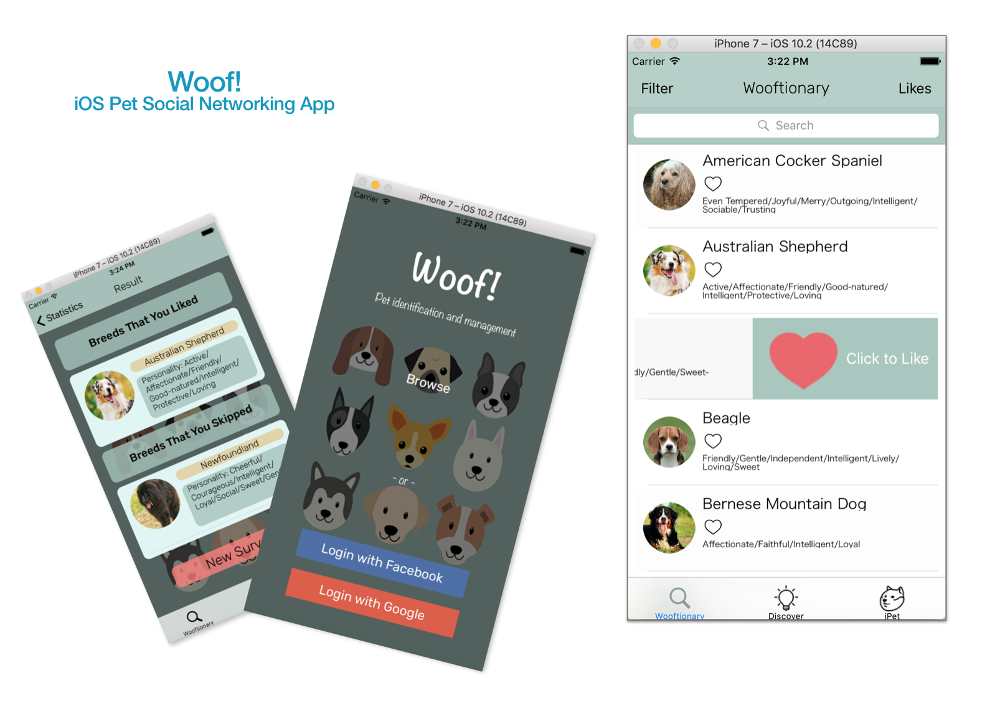

## Woof!
Woof! is an iOS application centered around dog seekers and dog owners. 

 

This project is a course project for [CSE110 Software Engineering](http://ieng6.ucsd.edu/~cs110x/) at UC San Diego. See the approriately music-backed [video demo of this app](https://www.youtube.com/watch?time_continue=1&v=JSJSSLUE4IE). 

This project is accomplished via joint team effort from Kim Jasper Mui, Zhiran Chen, Renxu Hu, Ye Zhao, Jianhan Xu, Shifan Zhang, Siya Li, Lusha Li, Xinyi Yang. 
